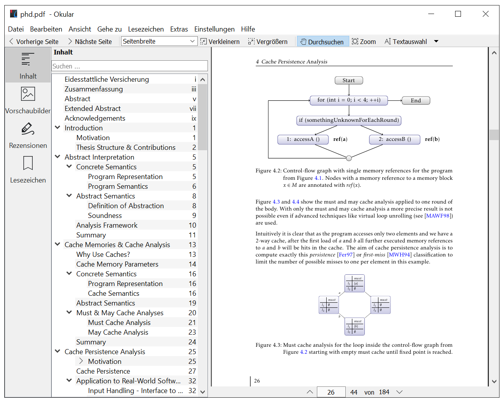
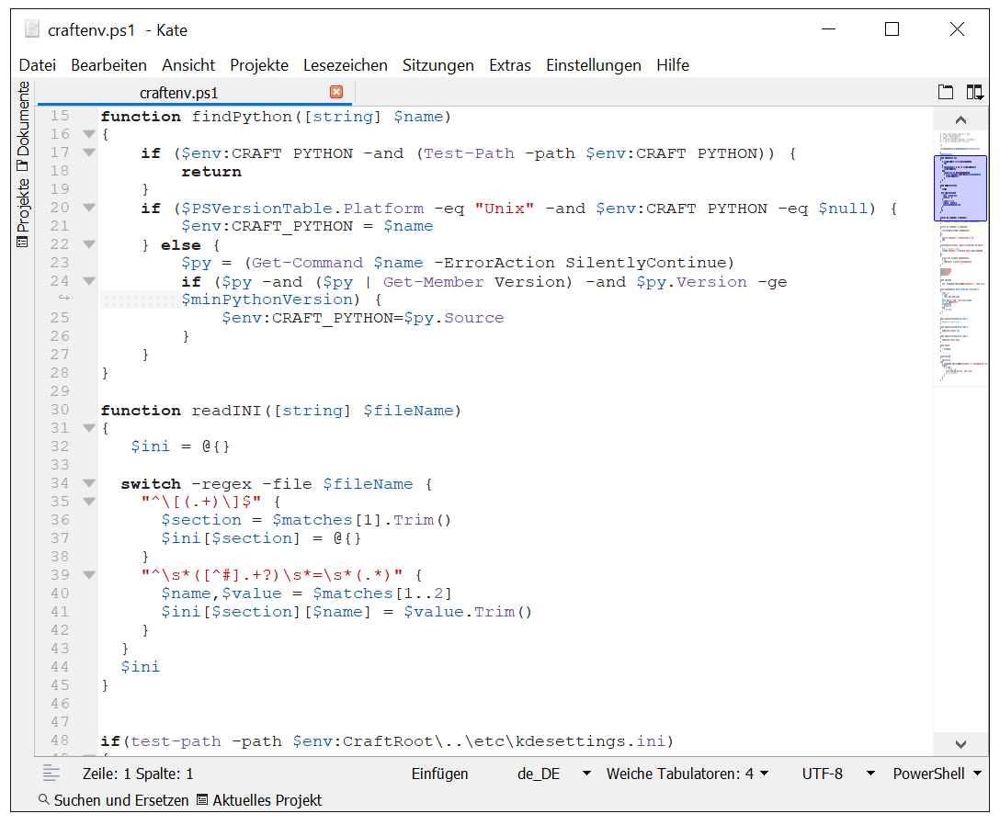

#### KDE applications on Windows?

One of the new [goals of KDE](https://dot.kde.org/2019/09/07/kde-decides-three-new-challenges-wayland-consistency-and-apps) is to spread the use of the applications created by the KDE community.
This doesn't only include the use of them on Linux & other Unix-like operating systems, but Windows, too.

#### The Successes :)

The KDE community has some successfully cross-platform applications out there, like [Krita](https://krita.org/) and [GCompris](https://gcompris.net/).
The teams behind these applications did some great job to both develop & market them for all operating systems, including Windows.

#### The Remaining Stuff :(

Wheres many KDE application can already be built on Windows since years, they have not found a wide spread use there.

For example [Kate](https://kate-editor.org), the text editor I maintain, is there mostly unknown.
Actually most of the applications we ship with the [KDE Applications releases](https://kde.org/announcements/announce-applications-19.08.1.php) are not widely known on Windows (nor used).

#### The Plan!

Already last year we came up with [the task](https://phabricator.kde.org/T9575) to bring more of our applications to the official [Microsoft Store](https://store.microsoft.com) to increase their visibility for the average Windows user.

#### The Building Blocks

Hannah von Reth & Kevin Funk provided the means to achieve this:

* [Craft](https://community.kde.org/Craft) - a meta build system / package manager that can be used on Windows for our stuff
* [KDE Binary Factory](https://binary-factory.kde.org/) - a CI that actually even creates fully signed installers and packages for the store!

Without their work, nothing would have happened for the "we publish stuff in the store" task.

More details about that can be found in the wiki and older blog posts:

* [Using Craft on Windows](https://community.kde.org/Guidelines_and_HOWTOs/Build_from_source/Windows)
* [Tips for streamlining KDE applications for deployment on Microsoft Windows](http://kfunk.org/2017/12/20/tips-streamlining-kde-application-for-deployment-microsoft-windows/)
* [CI for Windows installer and macOS bundle generation: KDE Binary Factory](http://kfunk.org/2017/11/17/kde-binary-factory/)

#### Our Progress :=)

Based on that work, some applications got now published with the [KDE e.V.](https://ev.kde.org/) account to the Microsoft Store.
The first was [KStars](https://kde.org/applications/education/org.kde.kstars) and after a long gap [Kate](https://kate-editor.org) & [Okular](https://okular.kde.org) followed.

Direct links to the store entries can be found below (the screenshots are in German, made in a Win10 VM, yes, i18n works on Windows just fine):

* [Okular - more than a reader](https://www.microsoft.com/store/apps/9N41MSQ1WNM8)

* [Kate - Advanced Text Editor](https://www.microsoft.com/store/apps/9NWMW7BB59HW)

* [KStars - Astronomy Software](https://www.microsoft.com/store/apps/9PPRZ2QHLXTG)

#### Help Wanted!

At the moment, this is the effort of only a few people and it will only be sustainable if we gain more support.

Therefore, if you are interested in bringing more of our applications to Windows and helping to maintain them, join in at [this Phabricator task](https://phabricator.kde.org/T9575).

The tooling might still be a bit rough to use in some places and the documentation is not perfect, but this can be improved!

#### Why all that?

I think there is a large user base on Windows that might benefit from our applications and we will benefit from potential more contributors, too.

Some might say: "Why shall we provide our applications on a proprietary operating system? People shall use fully open systems!"

I say: "Why shall we ignore all the people that are stuck with a proprietary operating system out of whatever reason?"

#### P.S.

And no, the idea is not to publish the stuff exclusively in the Microsoft Store.

The [KDE Binary Factory](https://binary-factory.kde.org/) outputs normal installers and portable archives, too.

The Microsoft Store is just a good way to advertise our applications to a broader scope of potential users.
The KDE e.V. published applications are there available for free but you can use any other means to install them.
