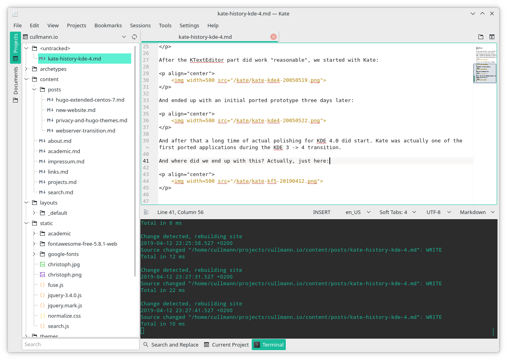

During my web site upgrade, I reviewed the old stuff I had hosted on my long gone web sites but still archived here locally. An interesting thing I stumbled on are the KDE 3 -> 4 porting screenshots of Kate I saved in 2005.

They actually show pretty nicely how far we have gone since 2005 with our development stack.

The KDE 3 -> 4 transition was a large hassle. It did take weeks of work just to get Kate back into an usable state.

We first started with some trivial KTextEditor container (a mini KWrite) for the porting to get KTextEditor at all doing something. That started out with something that even had no menu or toolbars working:

    

This evolved after two days into a kind of working KWrite port (icons still randomly missing):

    

After the KTextEditor part did work "reasonable", we started with Kate:

    

And ended up with an initial ported prototype three days later:

    

And after that a long time of actual polishing for KDE 4.0 did start. Kate was actually one of the first ported applications during the KDE 3 -> 4 transition.

The KDE 4 -> KF5 transition was much nicer, even thought the Frameworks split did cost a lot of time and resources. But the actual changes to the application code bases were not that radical.

And where did we end up with this ~14 years later? Actually, just here:

     

It is still recognizable the same application, thought I hope some progress is visible :=)
