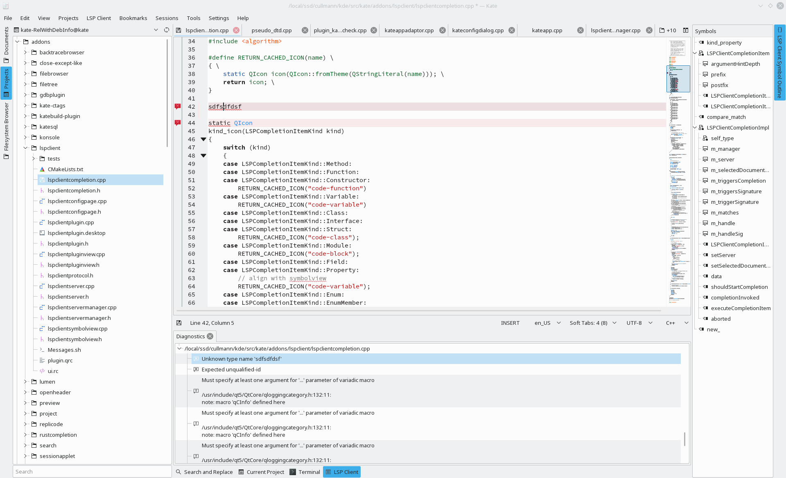
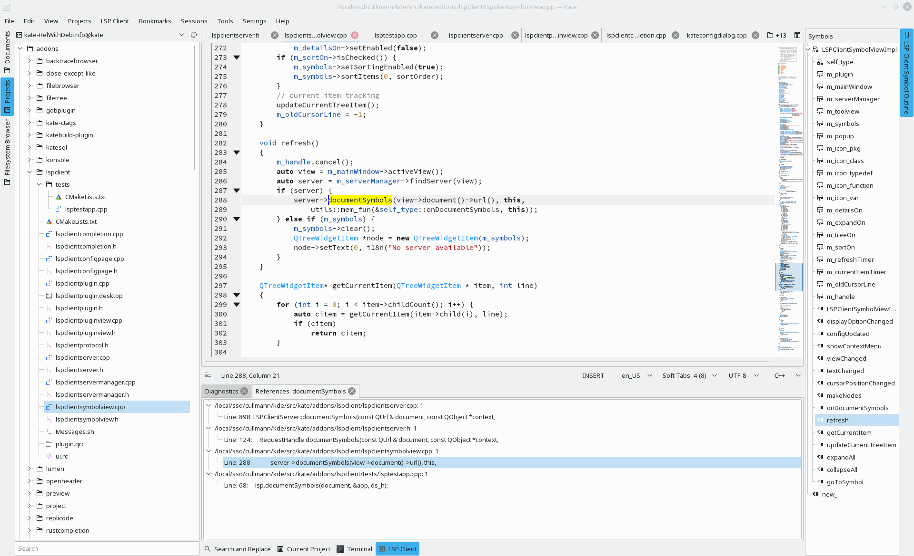

The new LSP client by Mark Nauwelaerts made nice progress since the [LSP client restart](/posts/kate-lsp-client-restart/) post last week.

Reminder: The plugin is not compiled per default, you can turn it on via:

> cmake -DCMAKE_INSTALL_PREFIX="your prefix" -DENABLE_LSPCLIENT=ON "kate src dir"

The code can still be found kate.git master, see [lspclient](https://cgit.kde.org/kate.git/tree/addons/lspclient) in the addons directory.

What is new?

* Diagnostics support: A tab in the LSP client toolview will show the diagnistics, grouped by file with links to jump to the locations. Issues will be highlighted in the editor view, too.

    

* Find references: Find all references for some variable/function in your complete program. They are listed like the diagnostics grouped per file in an extra tab.

    

* Improved document highlight: Highlight all occurrences of a variable/... inside the current document. Beside highlighting the reads/writes/uses, you get a jump list like for the other stuff as tab, too.

    

A feature I missed to show last time:

* Hover support: Show more meta info about a code location, like the proper type, useful e.g. for [almost-always-auto](https://herbsutter.com/2013/08/12/gotw-94-solution-aaa-style-almost-always-auto/) C++ programming.

    

We even got already two patches for the fresh plugin:

* [D22348 - Use the label when insertText or sortText is missing](https://phabricator.kde.org/D22348)
* [D22349 - Don't send the Content-Type header](https://phabricator.kde.org/D22349)

Both are aimed to improve the support of the Rust LSP server.
As you can see, they got already reviewed and merged.

Feel welcome to show up on [kwrite-devel@kde.org](mailto:kwrite-devel@kde.org) and help out!
All development discussions regarding this plugin happen there.

If you are already familiar with Phabricator, post some patch directly at [KDE's Phabricator instance](https://phabricator.kde.org/differential/).

You want more LSP servers supported? You want to have feature X? You have seen some bug and want it to vanish? => Join!
