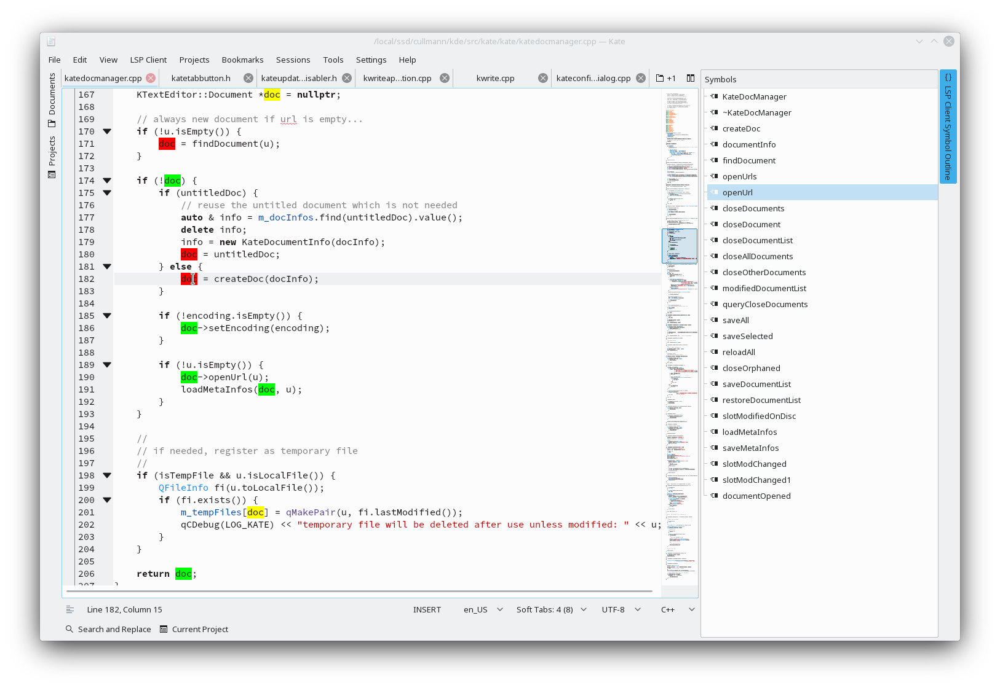

Since my last post about the [LSP client progress](/posts/kate-lsp-client-progress/) in May I didn't work on that project at all I think.

But the good news is, somebody else did scratch that itch on his own ;=)

We have now a prototype plugin in kate.git master, see [lspclient](https://cgit.kde.org/kate.git/tree/addons/lspclient) in the addons directory.

It is not compiled per default, you can turn it on via:

> cmake -DCMAKE_INSTALL_PREFIX="your prefix" -DENABLE_LSPCLIENT=ON "kate src dir"

It shares no code with my initial prototype.
The author started this without knowing of my work.
This might actually be not that bad, as this plugin is composed of a much smaller code base.
This allows to get familiar with the code easier as with the code I copied over from Qt Creator for my initial try.

But, even nicer, it does actually work a lot better than my variant, already now!

What does work (tested with clangd and kate.git/work projects) at the moment:

* Auto completion: you get the proper LSP server provided completion items

    

* Outline view: Get an extra tool view with the symbols of your current view

    

* Document highlight: highlight all occurrences of a variable/... inside the current view

    

* Code navigation: jump to the definition/declaration

There is still a lot of stuff missing and this is all prototype quality.
For example the document highlight implementation I added has no way to clear the highlighting at the moment beside document reload.

But given I just needed one hour to add the document highlight support, I would say the code base is easy to adjust.

=> If you have time and want a good LSP client, now you can join the fun and have direct results.

As the author was kind enough to move his work on the plugin to the KDE infrastructure, feel welcome to show up on [kwrite-devel@kde.org](mailto:kwrite-devel@kde.org) and help out!
All development discussions regarding this plugin happen there.
We are happy to accept patches, too, if you are a new contributor!
