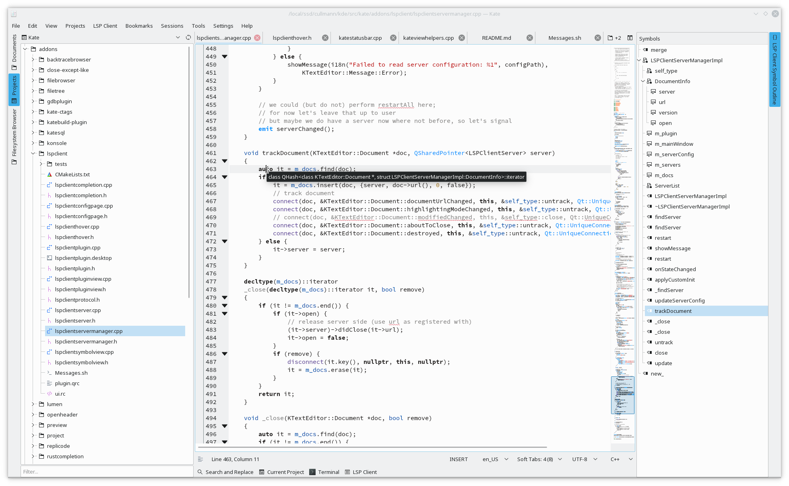

The new LSP client by Mark Nauwelaerts keeps making nice progress.

It will not be shipped with the KDE Applications 19.08 release, but in master it is now compiled & installed per default.
You only need to activate it on the plugin configuration page in Kate's settings dialog to be able to use it.

For details how to build Kate master with it's plugins, please take a look at [this guide](https://kate-editor.org/build-it/).

If you want to start to hack on the plugin, you find it in the kate.git, [addons/lspclient](https://cgit.kde.org/kate.git/tree/addons/lspclient).

Feel welcome to show up on [kwrite-devel@kde.org](mailto:kwrite-devel@kde.org) and help out!
All development discussions regarding this plugin happen there.

If you are already familiar with Phabricator, post some patch directly at [KDE's Phabricator instance](https://phabricator.kde.org/differential/).

What is new this week?

The most thing are internal cleanups and minor improvements.

Feature wise, the hover implementation works now more like in other editors or IDEs, you get some nice tool tip after some delay:

    

Never try to guess again what some *auto* means ;=)

There is still a lot that can be improved, e.g. a filter for the symbols outline is in work:

* [D22592 - port symbols view to model/view concept](https://phabricator.kde.org/D22592)

To be able to later out-source some parts of the generic LSP client code to a library, if there is demand, we will aim to make the plugin be licensed under the MIT license.
This should make it easier for other projects to depend of our code, if wanted.
