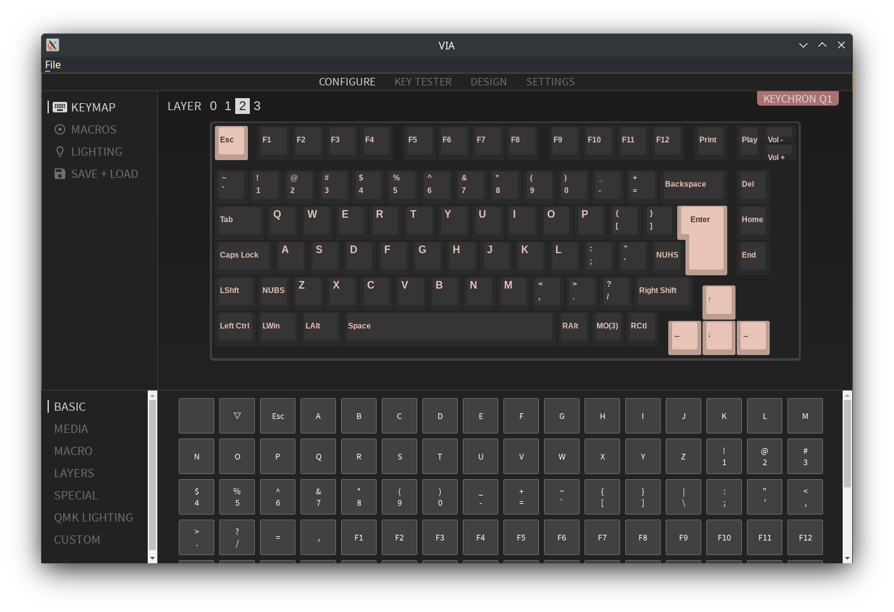
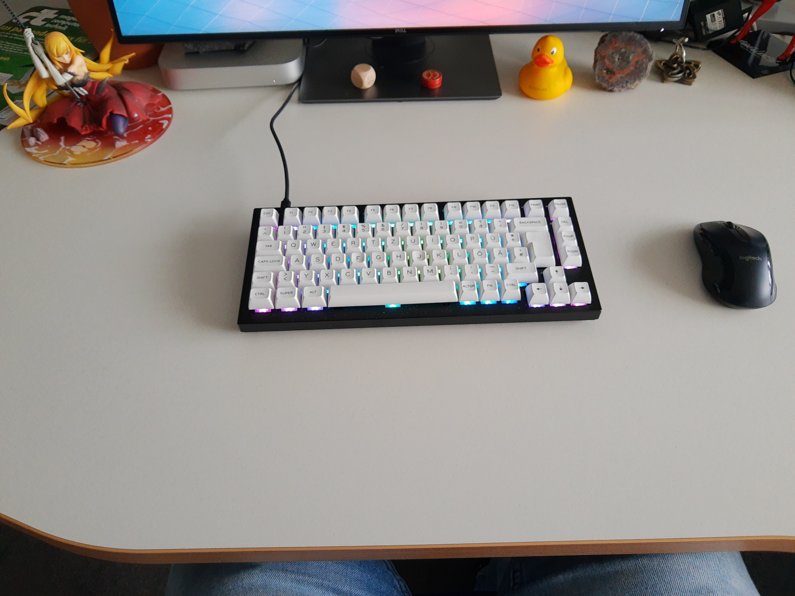
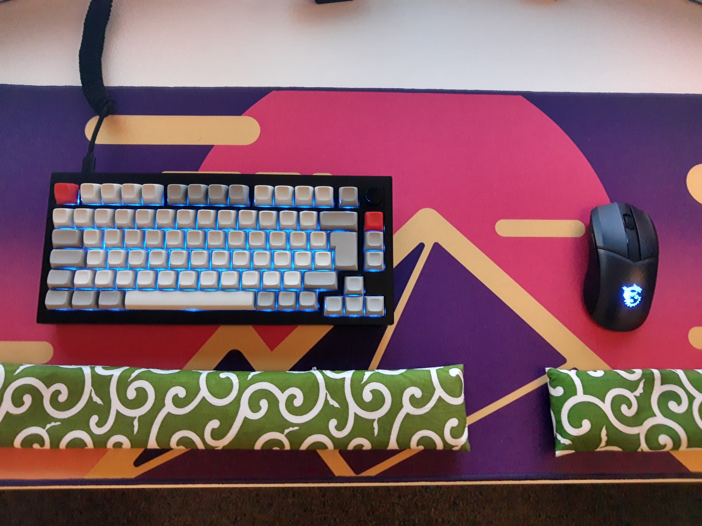

## Keyboards and Open-Source, how is that related?

In my [Keyboard Fun](/posts/keyboard-fun/) post from last year I talked a bit about my interest in mechanical keyboards.

Since then, I played around with a few more keyboards/switches/keycaps/...

Interesting enough, beside the actual hardware, naturally there is some software component to all these keyboards, too.

Whereas most commercial keyboards still come with proprietary firmware, there is the trend within the keyboard enthusiast scene to go for open-source firmware.

This allows you to properly update the firmware even from your Linux machine and do proper configuration of e.g. the keymap, too.

## QMK Firmware

A popular project in that area is [QMK](https://qmk.fm/).

I supports a mass of keyboards out of the box already and is actively extended by both volunteers and some companies.

That means it is deployed not only on main stream products but even in more exotic projects like the "I improve my vintage and modern Model M keyboards" by [Eric S. Raymond](https://gitlab.com/esr/m-star).

## VIA

Whereas QMK provides the open-source firmware part and you can do close to everything with it that is possible, given the features your hardware actually has, it is hard for simple task like "I want that my key x does y".

Naturally you can change the keymap in your QMK port and compile & flash.
But even I would call this a sub-optimal workflow, given a lot of commercial offerings at least provide some GUI to do this on the fly.

Here [VIA](https://caniusevia.com/) comes into the picture.

For sure, it is an Electron based monster, but it provides a cross-platform UI for QMK based keyboards that allow on the fly configuration of at least the common things, like keymaps.
And it provides trivial things like testing all your keys, which is not that unneeded, given I was too dumb to properly install all my hot-swap switches ;)

## Actual Keyboard?

Naturally, after this talk about the software side, all this makes no sense without an actual keyboard using it.

As I use the German ISO layout for typing, I am more limited on product choices than e.g. people using the ANSI layout.

It is really frustrating that where ever you look for some cool keyboard project, in many cases no ISO variant is available.
And yes, I don't want to switch to ANSI, I like to have my umlauts easily accessible and I can't swap all keyboards I need to use at work with ANSI variants, others would be not amused.

Therefore, if you are in need of some ISO layout keyboard, you might be interested in the information below.
If you use ANSI, ignore all this, there are masses of ANSI keyboards out there to buy, with QMK, too.
I have done no great research how the keyboard I did choose compares to them, for ISO there were not that many available contenders that were 75%, hot-swap and QMK ready.

After some trial and error I went with a Keychron Q1 75% keyboard.
It is available in ISO layout, unfortunately only as bare bone kit, that means you must buy your own switches and keycaps.
It naturally comes already with factory installed QMK, nice, above the VIA screenshot was actually from this board on my Linux machine.

For switches, I went with some BOX Navy switches, they are very heavy but have a nice click ;)
Even my office neighbor is happy with the sound and hasn't yet attacked me.
I won't link random reviews of them, you can search for that yourself if you are interested.
In any case, yes, they are HEAVY, really, you can believe that from the reviews.
And they are loud, but in no bad way.

For keycaps, yeah, same issue with the German ISO layout, there are not many sets that are available.

At work I now have some [SA profile](https://www.keycaps.info/) set from Signature Plastics, they are able to produce sets with proper legends and no missing German keys, unlike some other vendors I tried (and yes, I tried it with cheap vendors, it seems not to be trivial at all print all the proper German keys at all and not just forget them in the package...).
Funny enough, shipping from US did take 4 weeks, even with air express, USPS seems to be not the fasted variant of travel.
If others play with the idea to buy there, I must confess the quality is really good, but they are expensive, if you don't require exotic layouts like German, I would rather go with some cheaper sets, for US ANSI even the cheapest I tried out were ok, without obvious faults.

If you look a bit more around on the picture you will see I have still my good old Nokia rubber ducky, a sole survivor from the time Nokia owned Qt :P
And no, I don't use a Mac, that is just one we use for our compile farm.

At home I went with some [MT3 profile](https://matt3o.com/about-mt3-profile-and-devtty-set/) set without any legends, that is really cheap and funny enough did take only 4 days from US to Germany with standard UPS.

:=) And no, no second Nokia ducky at home.

So far, the Q1 works nicely, both at work and at home.
Having the exact same layout and switches in both places really helps to get used to it.

Using VIA works nicely, too.
So far I have not flashed any updated QMK version, therefore no experience how well that works in practice.

I actually even learned a bit more about my use of the different keys.
On the work picture you still see on the right the page up/down buttons (with Fn key => home/end).
At home I already reprogrammed that to home/end (with Fn key => page up/down), as I use that far more often during editing whereas the page up/down stuff just rarely in the terminal.
Actually, I didn't know I would miss these two keys until they were no longer easy accessible ;=)
