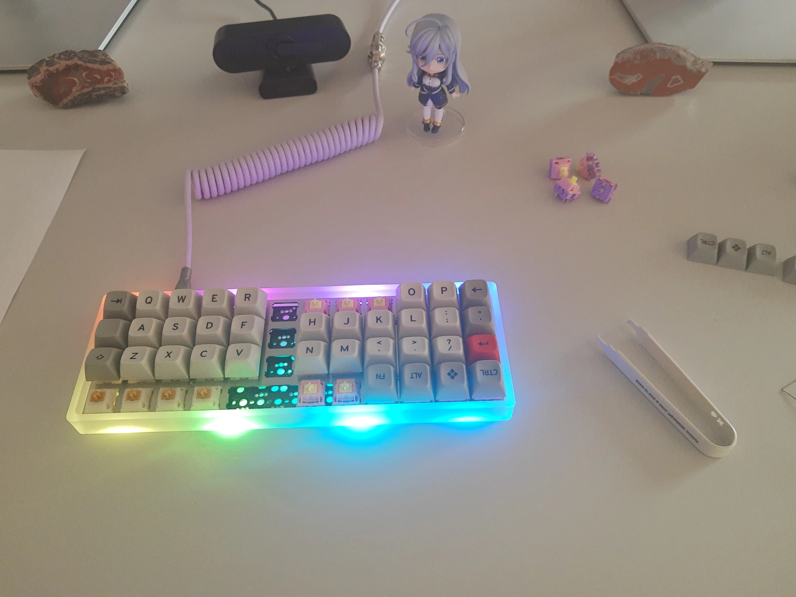

## The Planck Keyboard

Over the past two years I tried out a few different keyboards for fun.

I started with common form factors like TKL boards, went over 75% boards like the [Q1](/posts/keyboards-and-open-source/) and then to a 60% [HHKB](https://en.wikipedia.org/wiki/Happy_Hacking_Keyboard).

For typing feel, the HHKB is really amazing, but unfortunately the programmable features of a stock HHKB board are very limited.

Now that I went down to 60%, I will give a more extreme keyboard a chance, the 40% Planck ortholinear keyboard.

This one is fully open-source, you can even produce your own PCBs and Co.
You find more or less all stuff freely at [GitHub](https://github.com/olkb).

Given that the Plank designer funded [QMK](https://qmk.fm), too, naturally you can fully customize the Planck boards.

Unlike for my tries with the Q1, this time I just went the plain QMK route, without any UI like the closed [VIA](https://www.caniusevia.com/) or the open [VIAL](https://get.vial.today/).

The Planck board offers a nice platform for experiments, given the plain grid layer that allows really to freely shuffle all your keys and experiment with extreme layouts.

## Install QMK on NixOS

As I use at the moment [NixOS](https://nixos.org) at home, here the needed steps to get going with QMK on that distribution.

Install the qmk package. This will install the needed cross compile tool chains, too.

Ensure the udev rules are setup, e.g. add to your configuration.nix


services.udev.packages = [ pkgs.qmk-udev-rules ];


Run qmk setup, here with some own firmware location


qmk setup -H ~/install/qmk/firmware


Configure QMK to use the Planck as default


qmk config user.keyboard=planck/rev6_drop


Use my github name as keymap name


qmk config user.keymap=christoph-cullmann


Create own keymap based on default


qmk new-keymap


Compile the firmware


qmk compile


Put the keyboard in boot loader mode (e.g. trigger RESET)

Flash the firmware


qmk flash


Now the keyboard should auto-restart with the new firmware.

## Have fun :)

Below the state of a finalized Planck board with some more or less standard first layer layout.

It even plays a nice startup sound on powering up.

My current keymap can be found on [GitHub](https://github.com/christoph-cullmann/qmk).

As the history of this repository shows, I already experimented if some different layouts.

## Warning ^^

Yes, the paper on the left of the keyboard is a printout of the lower & raise keyboard layers.

My typing speed is still abysmal on that new layout and I guess I need to build as second one for at work, otherwise I will never get used to the layout if I swap daily between this and a HHKB.

Therefore, if you like to try such a board and are not a lot more experienced with switching between different layouts: you will need some time to get used to this.

Even just the removed row staggering is confusing the first few days.

